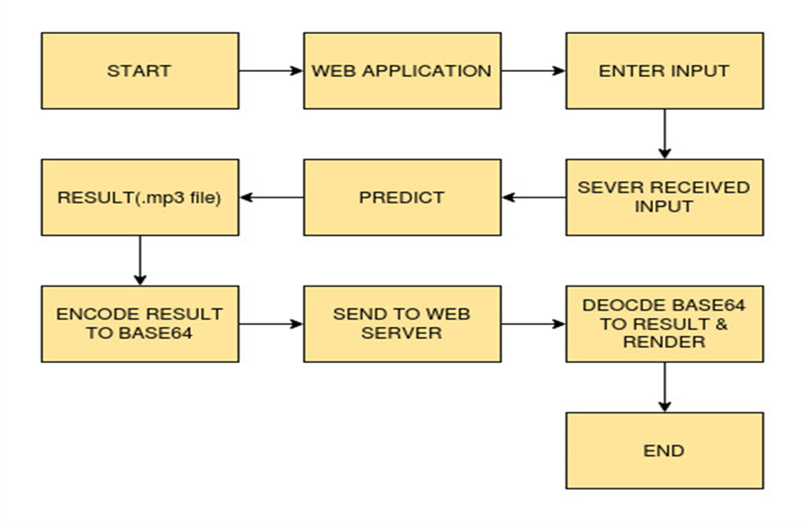

## Badges

Add badges from somewhere like: [shields.io](https://shields.io/)

[](https://www.python.org/downloads/release/python-360/)

[](https://shields.io/)
# TEXT to SPEECH

Acheive the problem of converting textual data into speech data.

### Description
 
As we know, some people have difficulty reading large amounts of text due to dyslexia and other learning disabilities. Some people have basic literary levels. They often get frustrated trying to browse the internet because so much of it is in text form or on other hand some people prefer to listen or watch a news article (or something like this) instead of reading. So to solve all these problems a concept comes into mind that is ”text to speech”.
Text-to-speech (TTS) technology reads aloud digital text. It can take words on computers, smartphones, tablets and convert them into audio.
We will be using Google Text to Speech commonly known as the gTTS API. It is very easy to use the library which converts the text entered, into an audio file which can be saved as a mp3 file. It supports several languages and the speech can be delivered in any one of the two available audio speeds, fast or slow.

## work Flow Diagram

 

# How run it?

### STEPS:
Clone the Repository

```bash
  https://github.com/Naveen0821/creditcard_frauddetection.git
```
### STEP 01- Create a conda environment after opening the repository

```bash
  conda create -n your_env_name python=3.6

```
```bash
  conda activate your_env_name

```
### STEP 02- install the requirements
```bash
  pip install -r requirements.txt

```
```bash
  python clientApp.py

```
